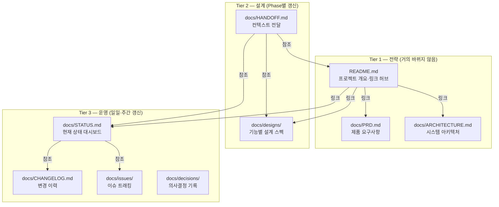
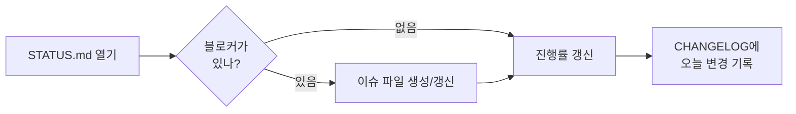
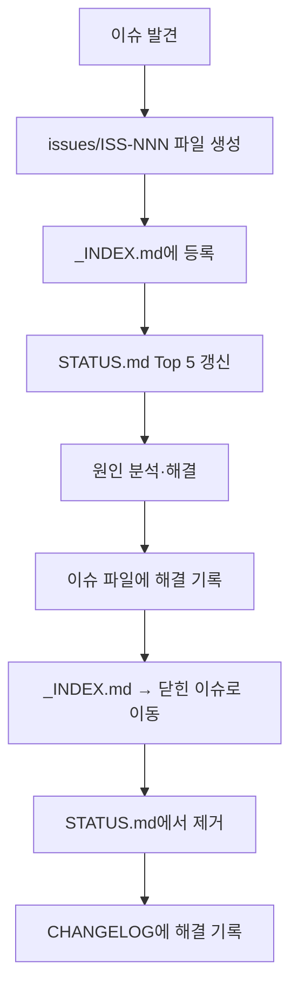

# Plowth 문서 체계 재설계 제안

## 1. 현재 구조 진단

### 핵심 문제점

| 문제 | 해당 문서 | 영향 |
|------|-----------|------|
| **역할 과부하** | `STATUS_LOG.md` | Snapshot + Review + Validation + Progress + Open Items를 한 파일에 누적 → 페이지가 길어질수록 "지금 뭐가 문제?"를 찾기 어려움 |
| **참조 vs 운영 미분리** | `HANDOFF.md` | 컨텍스트 전달 문서가 참조서 역할도 함. 일일 확인용으로 열기엔 너무 큼 |
| **설계 문서 산재** | `CAPTURE_FLOW_REDESIGN.md`, `sync-strategy.md` | 기능별 설계 문서가 flat하게 나열. Phase/기능별 탐색이 비효율적 |
| **이슈 추적 부재** | — | 버그/이슈가 발생했을 때 기록하고 해결 상태를 추적하는 전용 채널이 없음 |
| **변경 이력 혼재** | `STATUS_LOG.md` | "현재 상태"와 "과거 기록"이 같은 파일에 있어 스냅샷 갱신 시 이전 기록 관리가 불편 |

### 근본 원인

> **하나의 파일이 "대시보드 + 로그 + 이슈트래커"를 동시에 담당하고 있다.**
> 
> 문서의 역할(뭘 보여주는가)과 수명(얼마나 자주 바뀌는가)에 따라 분리하지 않으면,
> 파일이 커질수록 "빠른 확인"이 불가능해진다.

---

## 2. 제안 아키텍처: 3-Tier 문서 체계



### 각 Tier의 역할

| Tier | 목적 | 갱신 주기 | 핵심 원칙 |
|------|------|-----------|-----------|
| **1 — 전략** | "이 프로젝트가 뭔지" 한눈에 파악 | Phase 전환 시 | 간결하게, 링크 허브로 |
| **2 — 설계** | "어떻게 만들 건지" 기술 참조 | 기능 설계·변경 시 | 기능별 독립 파일, 컨텍스트 자족적 |
| **3 — 운영** | "지금 뭐가 진행 중이고 뭐가 문제인지" | 매일/매주 | 최신 상태만 보이게, 이력은 분리 |

---

## 3. 상세 폴더 구조

```
D:/REAL/
├── README.md                          # 프로젝트 허브 (Tier 1)
├── docs/
│   ├── PRD.md                         # 제품 요구사항 (Tier 1)
│   ├── ARCHITECTURE.md                # 시스템 아키텍처 (Tier 1)
│   ├── HANDOFF.md                     # 컨텍스트 전달 (Tier 2)
│   │
│   ├── designs/                       # 기능별 설계 스펙 (Tier 2)
│   │   ├── capture-flow.md
│   │   ├── sync-strategy.md
│   │   └── ...
│   │
│   ├── STATUS.md                      # 현재 상태 대시보드 (Tier 3)
│   ├── CHANGELOG.md                   # 변경 이력 로그 (Tier 3)
│   │
│   ├── issues/                        # 이슈 트래킹 (Tier 3)
│   │   ├── _INDEX.md                  # 이슈 인덱스 (열린/닫힌)
│   │   ├── ISS-001_제목.md
│   │   ├── ISS-002_제목.md
│   │   └── ...
│   │
│   └── decisions/                     # 의사결정 기록 (Tier 3)
│       ├── ADR-001_기술선택.md
│       └── ...
```

### 현재 파일 매핑 (Migration Path)

| 현재 파일 | 이동 경로 | 변경 사항 |
|-----------|-----------|-----------|
| `STATUS_LOG.md` | `STATUS.md` + `CHANGELOG.md` | **분리**: 현재 스냅샷은 STATUS로, 누적 로그는 CHANGELOG로 |
| `README.md` | `README.md` (유지) | 링크 허브로 경량화 |
| `HANDOFF.md` | `HANDOFF.md` (유지) | 역할 유지, 참조 링크 업데이트 |
| `CAPTURE_FLOW_REDESIGN.md` | `designs/capture-flow.md` | 설계 디렉토리로 이동 |
| `sync-strategy.md` | `designs/sync-strategy.md` | 설계 디렉토리로 이동 |
| `어플 상세 초안.md` | `PRD.md` | 영문 파일명으로 정리, 정식 PRD로 승격 |

---

## 4. 문서별 템플릿

### 4.1 STATUS.md — 현재 상태 대시보드

> **원칙: 이 파일은 "지금 이 순간"만 보여준다. 이력은 CHANGELOG에 밀어낸다.**

```markdown
# 📊 프로젝트 현황 대시보드
> 최종 갱신: YYYY-MM-DD HH:MM

## 🚦 한줄 상태
<!-- 🟢 정상 / 🟡 주의 / 🔴 블로킹 -->
**🟡 Phase 3 캡처 플로우 재설계 진행 중 — UI 프로토타입 검증 필요**

## Phase 진행률

| Phase | 상태 | 진행률 | 블로커 |
|-------|------|--------|--------|
| P1 프로젝트 셋업 | ✅ 완료 | 100% | — |
| P2 코어 기능 | ✅ 완료 | 100% | — |
| P3 캡처 플로우 | 🔧 진행 중 | 60% | UI 프로토 검증 |
| P4 동기화 | ⏳ 대기 | 0% | P3 의존 |

## 🔥 열린 이슈 (Top 5)

| ID | 제목 | 심각도 | 담당 | 링크 |
|----|------|--------|------|------|
| ISS-003 | 캡처 플로우 메모리 릭 | 🔴 Critical | — | [상세](issues/ISS-003_캡처_메모리릭.md) |
| ISS-005 | 온보딩 스킵 시 크래시 | 🟡 Major | — | [상세](issues/ISS-005_온보딩_크래시.md) |

## 📋 이번 주 목표

- [ ] 캡처 플로우 UI 프로토타입 완성
- [ ] ISS-003 메모리 릭 수정
- [x] 온보딩 스크린 레이아웃 확정

## 🔗 빠른 링크

- [PRD](PRD.md) · [아키텍처](ARCHITECTURE.md) · [핸드오프](HANDOFF.md)
- [이슈 목록](issues/_INDEX.md) · [변경 이력](CHANGELOG.md)
```

**핵심 설계:**
- 스크롤 없이 전체 상황 파악 (1스크린 원칙)
- 이모지 기반 시각적 스캔
- 이슈는 Top 5만 링크, 전체는 INDEX에서 관리

---

### 4.2 CHANGELOG.md — 변경 이력 로그

> **원칙: STATUS.md가 갱신될 때, 이전 상태를 여기에 append한다.**

```markdown
# 📝 변경 이력

## 2026-04-11
### 변경
- Phase 3 진행률 55% → 60% 갱신
- ISS-003 분석 완료, 수정 브랜치 생성

### 검증
- 온보딩 스크린 레이아웃 UI 리뷰 통과

### 의사결정
- 캡처 플로우에서 수동 제목 입력 제거 확정 → [ADR-003](decisions/ADR-003_자동제목생성.md)

---

## 2026-04-10
### 변경
- ...
```

**핵심 설계:**
- 역순 시간순 (최신이 위)
- 카테고리 고정: 변경 / 검증 / 의사결정
- 간결하게 1-2줄씩, 상세는 링크로

---

### 4.3 issues/ISS-NNN_제목.md — 이슈 파일

```markdown
# ISS-003: 캡처 플로우 메모리 릭

| 항목 | 내용 |
|------|------|
| **상태** | 🔧 수정 중 |
| **심각도** | 🔴 Critical |
| **발견일** | 2026-04-09 |
| **관련 Phase** | P3 캡처 플로우 |
| **관련 파일** | `mobile/lib/features/capture/...` |

## 증상
캡처 화면에서 이미지 10장 이상 연속 추가 시 메모리 사용량이 선형 증가, 
약 20장에서 OOM 크래시 발생.

## 원인 분석
<!-- 분석 완료 후 기록 -->
- ImageProvider 캐시가 dispose되지 않음
- ...

## 해결 방안
<!-- 선택한 방안에 ✅ 표시 -->
- [ ] 방안 A: LRU 캐시 도입
- [x] 방안 B: 화면 이탈 시 명시적 dispose

## 해결 기록
- 2026-04-10: 원인 분석 완료
- 2026-04-11: 수정 브랜치 `fix/ISS-003-memory-leak` 생성

## 검증
- [ ] 이미지 30장 연속 추가 테스트
- [ ] 메모리 프로파일러 확인
```

**핵심 설계:**
- 이슈 하나 = 파일 하나 (독립적, 검색 가능)
- 메타데이터 테이블로 빠른 분류
- 발견 → 분석 → 해결 → 검증의 생명주기를 파일 내에서 완결

---

### 4.4 issues/_INDEX.md — 이슈 인덱스

```markdown
# 🐛 이슈 인덱스

## 열린 이슈

| ID | 제목 | 심각도 | Phase | 상태 | 생성일 |
|----|------|--------|-------|------|--------|
| [ISS-005](ISS-005_온보딩_크래시.md) | 온보딩 스킵 시 크래시 | 🟡 Major | P2 | 분석 중 | 04-10 |
| [ISS-003](ISS-003_캡처_메모리릭.md) | 캡처 플로우 메모리 릭 | 🔴 Critical | P3 | 수정 중 | 04-09 |

## 닫힌 이슈

| ID | 제목 | 심각도 | Phase | 해결일 |
|----|------|--------|-------|--------|
| [ISS-001](ISS-001_빌드에러.md) | Gradle 빌드 에러 | 🟡 Major | P1 | 04-05 |
| [ISS-002](ISS-002_API키노출.md) | API 키 하드코딩 | 🔴 Critical | P1 | 04-06 |
```

---

### 4.5 decisions/ADR-NNN_제목.md — Architecture Decision Record

```markdown
# ADR-003: 캡처 시 자동 제목 생성

| 항목 | 내용 |
|------|------|
| **상태** | ✅ 확정 |
| **결정일** | 2026-04-11 |
| **관련 Phase** | P3 |

## 맥락
사용자가 캡처할 때마다 수동으로 제목을 입력해야 하는 것이 주요 이탈 원인.
LLM 기반 자동 제목 생성으로 마찰을 제거하려 함.

## 선택지
1. **수동 입력 유지** — 현행 유지, 변경 비용 없음
2. **LLM 자동 생성 + 사후 편집** — 마찰 최소, 정확도 보완 가능 ✅
3. **규칙 기반 자동 생성** — LLM 비용 없음, 품질 한계

## 결정
**선택지 2 채택.** 
캡처 시 Gemini Flash로 제목을 자동 생성하고, 사용자가 필요 시 편집할 수 있도록 한다.

## 근거
- 사용자 테스트에서 수동 입력이 가장 큰 마찰 포인트로 확인
- Gemini Flash의 latency가 500ms 이내로 UX 저해 없음
- 사후 편집으로 정확도 이슈 완화

## 영향
- `capture_service.dart`에 LLM 호출 로직 추가
- 백엔드에 제목 생성 엔드포인트 필요
```

---

### 4.6 designs/기능명.md — 기능 설계 스펙

```markdown
# 캡처 플로우 재설계

| 항목 | 내용 |
|------|------|
| **Phase** | P3 |
| **상태** | 🔧 설계 확정, 구현 중 |
| **관련 ADR** | [ADR-003](../decisions/ADR-003_자동제목생성.md) |
| **최종 갱신** | 2026-04-11 |

## 목표
(이 설계가 해결하려는 문제와 목표)

## 설계 상세
(기술적 설계 내용 — 시퀀스 다이어그램, API 스펙, 데이터 모델 등)

## 구현 체크리스트
- [x] UI 와이어프레임
- [ ] 백엔드 엔드포인트
- [ ] Flutter 위젯 구현
- [ ] 통합 테스트

## 관련 이슈
- [ISS-003](../issues/ISS-003_캡처_메모리릭.md)
```

---

## 5. 운영 워크플로우

### 5.1 일일 루틴 (5분)



1. `STATUS.md`를 열고 한줄 상태 확인
2. 진행률·블로커 갱신
3. 새 이슈가 있으면 `issues/ISS-NNN_제목.md` 생성 + `_INDEX.md` 갱신 + `STATUS.md` Top 5 갱신
4. `CHANGELOG.md` 맨 위에 오늘 날짜 섹션 추가

### 5.2 이슈 발생 시 대응 플로우



**이슈 ID 규칙**: `ISS-NNN` 순번 자동 증가. `_INDEX.md`의 마지막 번호 + 1.

### 5.3 Phase 전환 시

1. `STATUS.md` Phase 테이블 갱신
2. `CHANGELOG.md`에 Phase 완료 기록
3. `HANDOFF.md` 갱신 (새 Phase 컨텍스트 반영)
4. 해당 Phase의 열린 이슈 정리 (닫거나 이월)
5. 필요 시 `ARCHITECTURE.md` 갱신

### 5.4 의사결정 시

1. `decisions/ADR-NNN_제목.md` 생성
2. `CHANGELOG.md`에 의사결정 항목으로 링크
3. 관련 설계 문서에 ADR 참조 추가

---

## 6. 핵심 운영 원칙

### 🎯 Single Source of Truth
> 동일한 정보가 두 곳 이상에 존재하면 안 된다.  
> 다른 문서에서 필요하면 **링크**로 참조한다.

### 📏 1스크린 원칙 (STATUS.md)
> 대시보드는 스크롤 없이 읽을 수 있어야 한다.  
> 상세는 반드시 링크로 위임한다.

### 🔄 현재 ≠ 이력
> "지금" (STATUS.md)과 "과거" (CHANGELOG.md)는 항상 분리한다.  
> STATUS는 덮어쓰기, CHANGELOG는 append-only.

### 🗂️ 하나의 관심사 = 하나의 파일
> 이슈 하나, 의사결정 하나, 설계 하나에 각각 독립 파일.  
> 파일명으로 검색 가능하고, git blame으로 추적 가능.

---

## 7. 기대 효과

| 현재 | 개선 후 |
|------|---------|
| "지금 상태가 뭐지?" → STATUS_LOG 전체 스크롤 | STATUS.md 1스크린으로 즉시 확인 |
| "이 버그 어디에 기록했지?" → STATUS_LOG 내 검색 | `issues/` 디렉토리에서 파일명으로 탐색 |
| "왜 이렇게 결정했지?" → 구두·기억에 의존 | ADR 파일에서 맥락·근거 확인 |
| "지난주에 뭐 했었지?" → STATUS_LOG 과거 기록 찾기 | CHANGELOG.md 날짜별 역순 조회 |
| "설계 문서가 어디 있지?" → docs/ flat 탐색 | `designs/` 디렉토리에 기능별 정리 |

---

## 8. 선택 사항: AI 에이전트 연동

이 체계를 AI 에이전트와 함께 사용할 때의 추가 이점:

| 작업 | 에이전트에게 요청할 수 있는 것 |
|------|------------------------------|
| 이슈 생성 | "ISS-NNN 파일 생성하고 INDEX 갱신해줘" |
| 상태 갱신 | "STATUS.md Phase 3 진행률 70%로 갱신하고 CHANGELOG에 기록해줘" |
| 이슈 조회 | "열린 Critical 이슈 뭐 있어?" → `_INDEX.md` 읽기 |
| Phase 전환 | "Phase 3 완료 처리해줘" → STATUS + CHANGELOG + HANDOFF 일괄 갱신 |

### 8.1 기본 운영 규칙

이 저장소에서는 아래 4개 작업을 **에이전트가 별도 지시 없이도 계속 확인·추적·반영**한다.

- `이슈 생성`: 새 버그/블로커/문서 불일치가 확인되면 `issues/ISS-NNN_제목.md` 생성, `_INDEX.md` 등록, `STATUS.md` Top 항목 반영
- `상태 갱신`: 진행률, 블로커, 우선순위, 핵심 문서 구조 변화가 생기면 `STATUS.md`와 필요 시 `CHANGELOG.md` 갱신
- `이슈 조회`: 열린 이슈 상태를 계속 확인하고, 관련 작업 중 발견한 정보로 이슈 파일과 인덱스를 갱신
- `Phase 전환`: 구현/검증/문서 기준이 충족되면 `STATUS.md`, `CHANGELOG.md`, `HANDOFF.md`의 공식 Phase 상태를 에이전트가 스스로 갱신

단, `Phase 전환`은 추정이나 희망 일정이 아니라 **실제 저장소 상태와 검증 결과**를 근거로만 수행한다.

각 문서가 역할별로 명확히 분리되어 있으므로, 에이전트가 어떤 파일을 읽고/쓸지 판단하기 쉬워진다.
